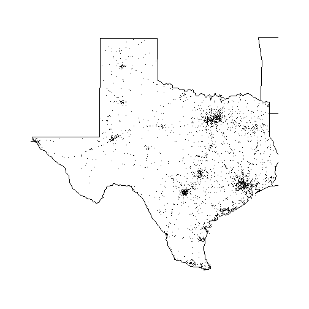

This package permits to display the accident data for a specific year and a specific US state in a graphical manner.

## Functions

The following functions are part of this package:
- fars_read()
- make_filename()
- fars_read_years()
- fars_summarize_years()
- fars_map_state()
## Examples

Running the below statment will create the file name for the accidents data file which contains the information of the year 2013.
[1] "accident_2013.csv.bz2"
Running fars_map_state(48,2013) will produce a map of Texas with the accident data of 2013.

